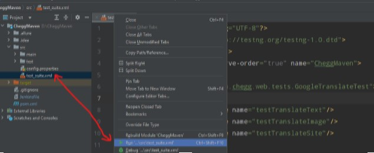
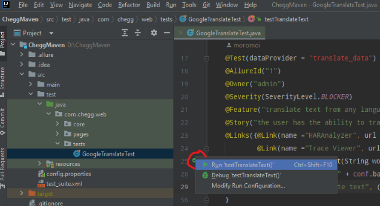
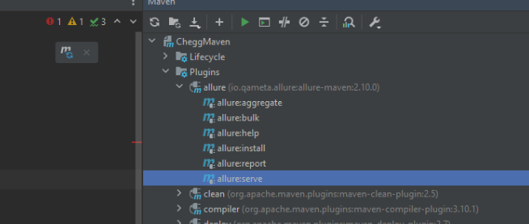
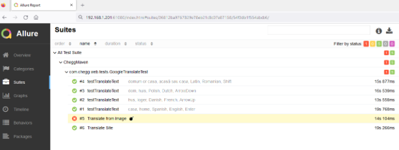

Ways to run tests:

 - From test_suit.xml in source of project
 - 

 - One by one from the test class
 - 

- Generate an Allure report by clicking on allure:serve in the Maven section
- 

- After a few seconds, the report will open in the browser
- 

- Test Suite with 6 step tests
The failed test include 4 type of logs - trace / screenshot / video / network
Trace Viewer is a GUI tool that helps you explore recorded Playwright traces
after the script has run. You can open traces in your browser on https://trace.playwright.dev/.by drop the trace file to the window
- HAR file with network traffic you can open on HAR Analyzer https://toolbox.googleapps.com/apps/har_analyzer/

